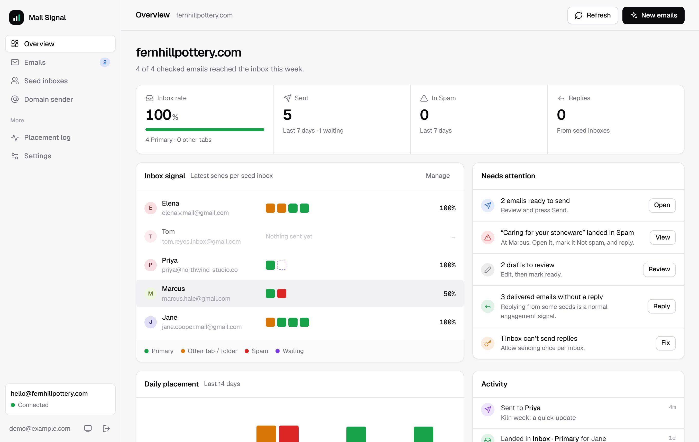

# Mail Signal

**Know where your domain’s email lands.**

Mail Signal is a small, self-hosted dashboard for warming up and monitoring a custom domain with Gmail inboxes you own. Draft ordinary emails with Gemini, send them yourself, see whether Gmail put them in Primary, Promotions or Spam, and reply from the same place.

It is manual by design:
- **Sending:** nothing is sent until you press Send.
- **Replies:** seed inboxes never reply on their own.
- **Placement checks:** these only read Gmail labels. Messages are never moved.



## Quick start

```sh
git clone https://github.com/karuridavid/mail-signal
cd mail-signal
docker compose up -d
docker compose logs app | grep "setup key"
```

Open http://localhost:8080, enter the one-time setup key, and create your admin login. The Overview page walks you through the rest:
1. Domain sender
2. Business brief
3. Gemini key
4. Google sign-in
5. Seed inboxes
6. First email

For a public HTTPS domain, set `DOMAIN` and `TRUST_PROXY=1` in `.env` and run `docker compose --profile https up -d`. Caddy then handles the certificate.

The full guide covers Google OAuth setup, HTTPS, Vercel + Neon, and configuration. It is on the project site at [mailsignal.vercel.app/self-host](https://mailsignal.vercel.app/self-host).

## How it works

1. **Connect** your domain's SMTP sender and the Gmail or Workspace inboxes you own (Google sign-in).
2. **Brief:** Gemini reads your public website and drafts a summary of the business. You correct it, or write it yourself.
3. **Draft and send:** Gemini writes a different, ordinary email for each inbox. You edit each one, mark it ready, and send it.
4. **Placement:** the app finds the exact `Message-ID` in the seed inbox and reads its labels. It reports Inbox (and the tab), Spam, Other folder, or Not found yet.
5. **Reply:** reply from the seed inbox, in the same thread. You write the reply or have Gemini draft it.

Gmail filters ("Never send to Spam", "Mark important") can be added per inbox and read back from Gmail to confirm they exist.

## Project layout

| Path | What it is |
| --- | --- |
| `index.html`, `app.js`, `app.css`, `assets/` | Dashboard (plain HTML/CSS/JS, no build step) |
| `api/app.py` | API: one `POST /api/app` endpoint dispatching on `action`, plus the Google OAuth callback |
| `gmail_api.py` | Small Gmail REST client (placement, send, filters) |
| `server.py` | Standalone server used by Docker; serves the dashboard and API |
| `site/` | Public project website (static) |
| `tests/` | Fake-services server, demo data and end-to-end API tests |

## Development

```sh
docker run -d --name ms-test-db -e POSTGRES_PASSWORD=dev -p 55432:5432 postgres:16-alpine
pip install -r requirements.txt
DEMO=1 python tests/fake_server.py      # http://localhost:18080 — demo@example.com / demo-password-123
```

`tests/fake_server.py` replaces Gmail, SMTP and Gemini with fakes. Against an empty database, run `python tests/test_api.py` for the end-to-end API tests.

## Responsible use

Mail Signal is for your own domains and inboxes you own. It sends one email at a time and has no lists, imports or campaigns. It can't guarantee inbox placement. SPF, DKIM, DMARC and real engagement matter far more.

## License

[MIT](LICENSE). Bundled fonts: Geist and Geist Mono, under the SIL Open Font License (`assets/fonts/OFL-Geist.txt`).
